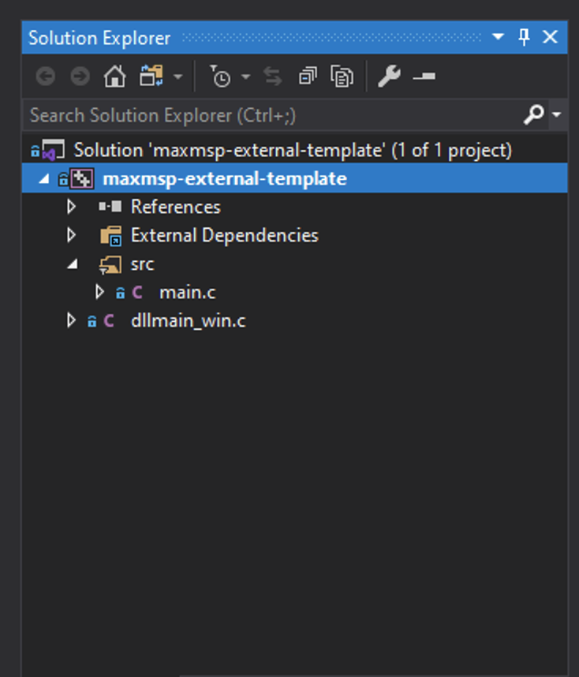
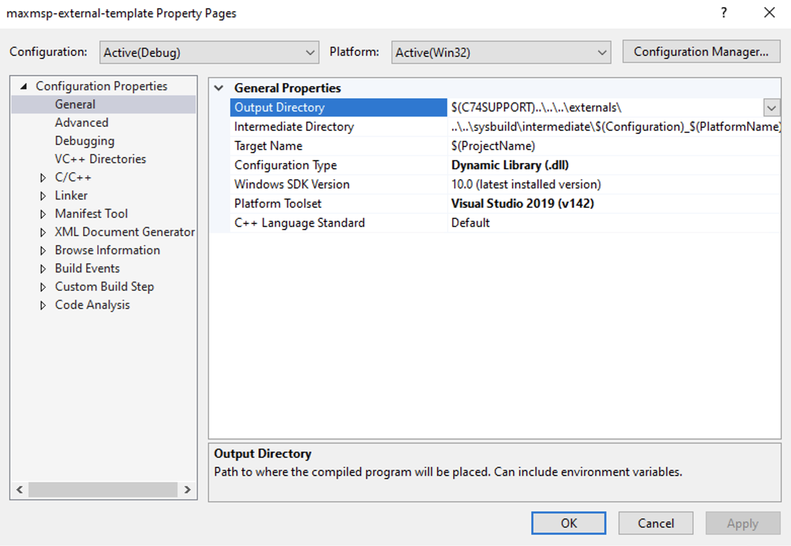
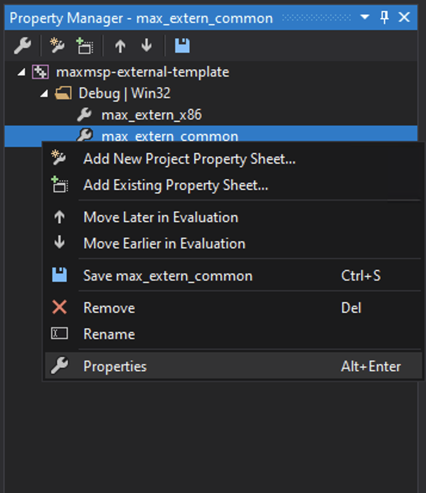
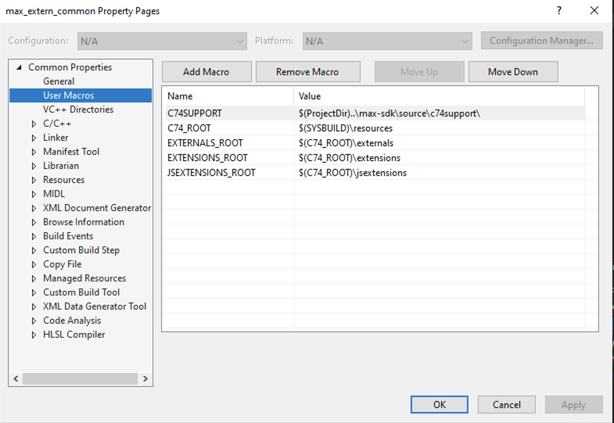
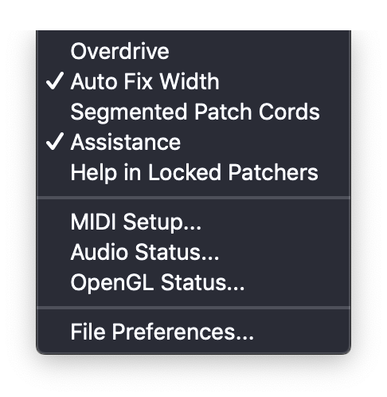

# maxmsp-external-template

Template Projects for building external objects in MaxMSP

<!-- TOC depthFrom:1 depthTo:6 withLinks:1 updateOnSave:1 orderedList:0 -->

- [maxmsp-external-template](#maxmsp-external-template)
	- [Setup](#setup)
	- [Cloning this Repository](#cloning-this-repository)
	- [Configuration](#configuration)
		- [maxmspsdk.xcconfig](#maxmspsdkxcconfig)
		- [.prop sheets](#prop-sheets)
		- [Max Setup](#max-setup)
		- [Change sdk Version](#change-sdk-version)
	- [Projects](#projects)
		- [max-external](#max-external)
		- [mspcpp](#mspcpp)

<!-- /TOC -->

## Setup

To get started, click _use this template_ at the top of the repository


then [follow the instructions for creating a repository](https://help.github.com/en/github/creating-cloning-and-archiving-repositories/creating-a-repository-from-a-template)

## Cloning this Repository

To make this repository a little more portable, the max-sdk has been included as a submodule. If you are using the [GitHub desktop app](https://desktop.github.com), the submodule will be cloned automatically. If you are using git from the command line, this means you will need to state `--recurse-submodules` when cloning.

Max will automatically create a `Max` folder in your `Documents` directory. I've found a nice way to work is to

- create a `developing` folder inside the `Max`
- clone the repository into that folder

In shell terms, this would be

```sh
cd "/path/to/Max Folder/developing"
git clone --recurse-submodules REPOSITORY_URL
```

You should be able to build straight away from the Xcode project or the Visual Studio solution.

## Configuration

Build configuration is slightly different depending on which IDE you are using. For Visual Studio you should be looking at the [property sheets](https://docs.microsoft.com/en-us/cpp/build/working-with-project-properties?view=vs-2019) and for Xcode the [`.xcconfig`](https://nshipster.com/xcconfig/).

### maxmspsdk.xcconfig

The `maxmspsdk.xcconfig` in the `xcode` directory sets a couple of global paths in the Xcode project. Some of these variables you can change others you should leave alone. The ones to change are

- `PRODUCT_VERSION`: which version of the max-sdk are you using?
- `DSTROOT`: destination of the built external (project relative directory)

### .prop sheets

To change the destination folder:

1. make sure you have highlighted the project in the _Solution Explorer_



2. Press <kbd>F4</kbd> or Properties by navigating the menus `View` -> `Properties...`

3. In Configuration Properties -> General you can change the Output Directory



For Visual Studio users, there should be nothing that you need to change in the property sheets. If you would like to change them or just take a look, you can edit them directly in any text editor as VS files are essentially XML files.

To edit the property sheets in visual studio:

1. make sure you have highlighted the project in the _Solution Explorer_


2. Select the property manager by navigating the menus `View` -> `Other Windows` -> `property manager`


3. Select a property sheet press <kbd>Alt</kbd> + <kbd>Enter</kbd> or right click and select properties



4. navigate to user macros




### Max Setup

You can have Max point to the `externals` folder generated by the project in order to load your objects

Go to `Options` -> `File Preferences`



### Change sdk Version

You can change the version of the `max-sdk` via the shell by checking out a specific tag

```sh
cd max-sdk
git checkout v7.0.3 # or v7.1.0 v7.3.3 v8.0.3
```

***

## Projects

The Xcode project has multiple targets to demonstrate how to approach building a maxMSP external `.mxo` file.

### max-external

The vanilla C approach. There are plenty of examples in the sdk, but this target aims to take a more modern approach. Documentation has been added inline as well as some slightly less obtuse variable name choices which will hopefully reduce the barrier of entry.

### mspcpp

If you have already coded a ton of DSP C++ classes for something like JUCE, you may want to start here.

Demonstrates using `extern "C"` to write wrappers for pre-existing c++ classes. you need only write wrapper functions for public class methods or anything that needs to be called directly in `C`
